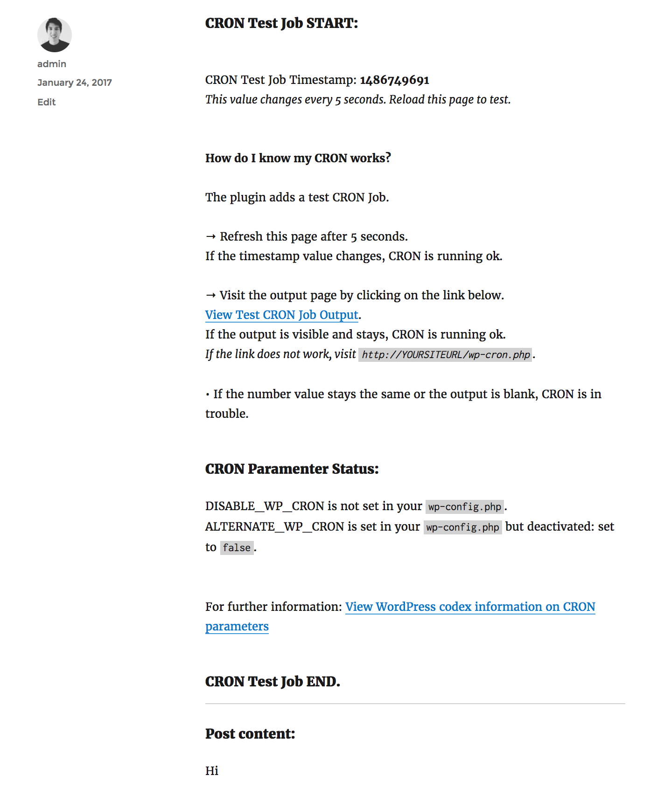

### Info
This plugin quickly answers the question **"Is my WordPress CRON service running ok?"**. 

It adds a test CRON job and displays debugging content by placing a shortcode `[crte]`. 

Place shortcode on any post or page to display the timestamp of the test CRON job among with information whether CRON has been disabled or if alternative CRON has been set via `wp-config.php`. 

### Screenshot

*Screenshot of the single post page*